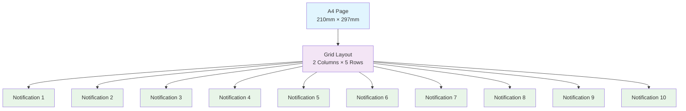
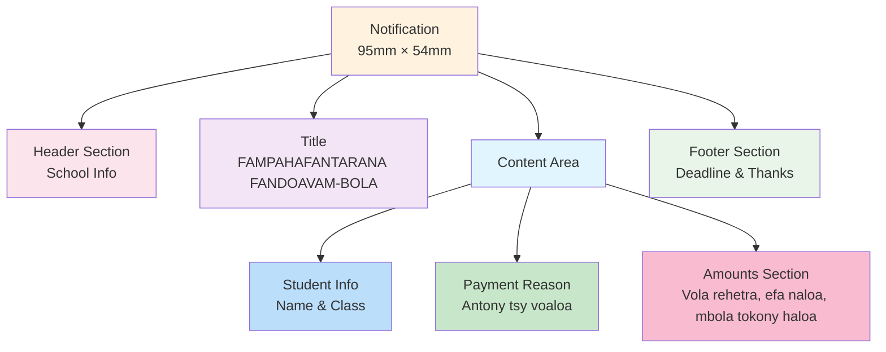

# Payment Notification Layout Visualization

## A4 Page Layout (210mm × 297mm)

## Individual Notification Structure

## Content Details

### Header Section
- School logo (8mm × 8mm)
- School name: COLLEGE PRIVE ADVENTISTE AVARATETEZANA
- Address: AMPITATAFIKA ANTANANARIVO MADAGASCAR
- Phone: Tél: 038 34 921 09

### Title Section
- FAMPAHAFANTARANA FANDOAVAM-BOLA (centered, bold)

### Content Area
1. **Student Information**
   - "Ho an'ny ray aman-drenin'i [Student Name]"
   - Class name

2. **Payment Reason**
   - "Antony tsy voaloa:"
   - Payment titles

3. **Amounts Section**
   - "• Vola rehetra tokony haloa: [amount] Ariary"
   - "• Vola efa naloa: [amount] Ariary"
   - "• Vola mbola tokony haloa: [amount] Ariary" (highlighted)

### Footer Section
- "Daty farany hanaovana fandoavam-bola: [deadline date]"
- "misaotra amin'ny fiaraha-miasa sy ny fandraisana andrakitra"
- Status and date information

## Layout Specifications

- **Page Size**: A4 (210mm × 297mm)
- **Margins**: 3mm
- **Grid**: 2 columns × 5 rows
- **Notification Size**: 95mm × 54mm
- **Gap Between Notifications**: 3mm
- **Font Size**: 7-8px for body text, larger for headings
- **Border**: 2px solid black
- **Background**: White
- **Page Breaks**: After each filled page